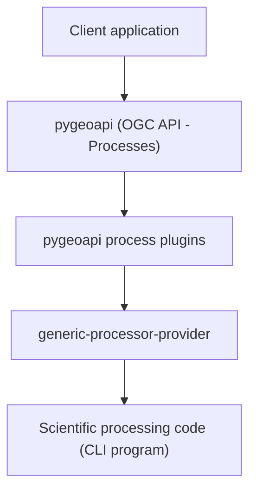

# INGV pygeoapi process plugins

[](https://doi.org/10.5281/zenodo.18892819)


Plugins implementing **OGC API - Processes** using **pygeoapi** for the
INGV pygeoapi processing platform.
(https://github.com/francescoingv/ingv-pygeoapi-processing-platform)

---

## Overview

This repository contains **pygeoapi process plugins** used by the
INGV pygeoapi processing platform to expose scientific processing
programs through the **OGC API - Processes** standard.

The plugins act as a bridge between:

- the **API layer** (pygeoapi)
- the **execution layer** (remote execution services)

Each plugin represents a scientific processing model and implements
the logic required to:

- receive execution requests from pygeoapi
- validate input/output parameters
- call a remote execution service
- collect execution results
- format and return results according to the **pygeoapi process specification**

Actual program execution is delegated to the **generic processor provider**.

---

## Design principles

The plugin architecture follows several principles:

- **API / execution separation**
- **Remote execution**
- **Reusable plugin framework**
- **Minimal coupling**

---

## Architecture diagram



---

## Plugin architecture

The repository provides a **base class**:

`BaseRemoteExecutionProcessor`

Responsibilities:

- manage communication with the execution service
- validate input parameters
- validate output requests
- collect execution results
- format results returned to pygeoapi

Derived classes must implement:

- `prepare_input()`
- `prepare_output()`

Derived classes must define:

- METADATA describing the service

---

## Platform components

| Component | Repository | DOI | Role |
|-----------|------------|-----|------|
| processing platform | [ingv-pygeoapi-processing-platform](https://github.com/francescoingv/ingv-pygeoapi-processing-platform) | https://doi.org/10.5281/zenodo.18892848 | platform architecture |
| pygeoapi process plugins | [ingv-pygeoapi-process-plugins](https://github.com/francescoingv/ingv-pygeoapi-process-plugins) | https://doi.org/10.5281/zenodo.18892819 | OGC API process implementation |
| generic processor provider | [generic-processor-provider](https://github.com/francescoingv/generic-processor-provider) | https://doi.org/10.5281/zenodo.18892842 | remote execution service |

---

## Scientific processing codes

Examples of models exposed through the platform:

- **pybox** – scientific processing model to simulate the dispersals
  of a gravity-driven pyroclastic density current (PDC)
  
  Repository: https://github.com/silviagians/PyBOX-Web
  DOI: https://doi.org/10.5281/zenodo.18920969

- **conduit** – scientific processing model for computing the one-dimensional,
  steady, isothermal, multiphase and multicomponent flow of magma
  in volcanic conduits

- **solwcad** – scientific processing model to compute the saturation surface of
  H₂O–CO₂ fluids in silicate melts of arbitrary composition

---

## Requirements

- Python 3
- pygeoapi
- access to the generic processor provider

Using a Python virtual environment is recommended.

Installing pygeoapi includes all runtime dependencies
(see the `requirements*.txt` files of the framework).

---
## Plugin Installation

Clone the repository:

```
git clone https://github.com/francescoingv/ingv-pygeoapi-process-plugins
```

Enter the project directory:

```
cd ingv-pygeoapi-process-plugins
```

Install the package:

```
pip install .
```

Alternatively, for development:

```
pip install -e .
```

---
## Usage

To use the plugins they must be registered in the **pygeoapi** configuration.

An example configuration is available in the file:

example-config.yml

Within the pygeoapi configuration file a process can be added by defining the corresponding Python plugin.

Simplified example:

```yaml
processes:
  example-process:
    type: process
    processor:
      name: ingv_plugin_pygeoapi.process.example_process
```

After configuring the process the OpenAPI configuration file must be generated, for example:

```
pygeoapi openapi generate example-config.yml --output-file example-openapi.yml
```

pygeoapi will automatically expose the corresponding API endpoint.

---

### Directory and job management

Each processing request is managed as a job identified by a UUID.

Each plugin is associated with a directory (defined in the plugin configuration via `private_processor_dir`),
under which a specific directory is created for each job,
identified by the unique job identifier (UUID - Universally Unique Identifier).

The plugin can read and write files within the job directory while processing:
- if the service has access to the plugin directory (shared directory),
  plugin and service can exchange files through it.

---

## External processing service interface

The external processing service must respond to the following request:

```text
POST /execute
```

The request `Content-Type` can be:

- `text/plain`
- `application/json`

The request body must contain a **JSON object** with the following fields:

```json
{
  "code_input_params": {
    "parameter_key": "parameter_value"
  },
  "application_params": {
    "job_id": "UUID",
    "synch_execution": true
  }
}
```

### Parameters

#### `code_input_params`

Dictionary containing `<parameter_key : parameter_value>` pairs.

Values can be:

- strings
- numbers
- booleans
- lists

#### `application_params`

Dictionary with the following keys:

- `job_id`
  Job identifier (UUID)

- `synch_execution`
  Optional, boolean, default `true`; indicates whether the request must
  be executed synchronously

---

```text
GET /job_info/<string:job_id>
```

Returns a JSON object containing job execution information.

---
## Docker usage

The plugin can be used inside a Docker container running pygeoapi.

In that case the following structure must be created:

```text
./
├── Dockerfile
├── my.pygeoapi.config.yml
└── ingv_plugin/
    ├── pyproject.toml
    ├── setup.py
    └── ingv_plugin_pygeoapi/
        ├── __init__.py
        └── process/
            ├── base_remote_execution.py
            ├── conduit.py
            ├── solwcad.py
            ├── pybox.py
            └── ...
```

The repository includes a Docker configuration that allows running the processing service in a container environment.

---

## Environment variables

Environment variables are referenced in the configuration file using placeholders of the form `$VARIABLE$`.

During deployment these placeholders must be replaced with the actual environment variable values.

---

## Related projects

This platform builds on:

**pygeoapi**\
https://github.com/geopython/pygeoapi\
DOI: https://doi.org/10.5281/zenodo.121585259

---

## Citation

If you use this software in scientific work, please cite it as:

Martinelli, F. (2026).
*INGV pygeoapi process plugins*.
DOI: https://doi.org/10.5281/zenodo.18892819

---

## License

This project is distributed under the **MIT License**.

See the `LICENSE` file for details.

---

## Author

Francesco Martinelli
Istituto Nazionale di Geofisica e Vulcanologia (INGV)
Pisa, Italy

------------------------------------------------------------------------

## Acknowledgements

Developed at the **Istituto Nazionale di Geofisica e Vulcanologia (INGV)**.

