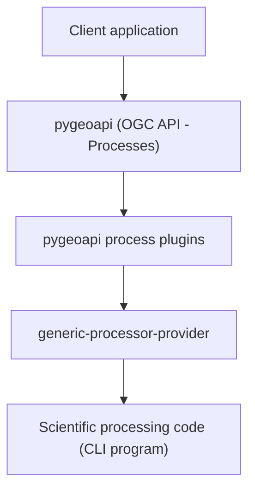

# EXPOSE plugins

[](https://doi.org/10.5281/zenodo.18892819)


Plugins implementing **OGC API - Processes** using **pygeoapi** for the
EXPOSE (EXecutables for OGC API PrOcesses and Scientific Environments) platform.
(https://github.com/francescoingv/expose-pygeoapi-platform)

This repository contains a collection of plugins that allows the exposure of processing services
compatible with the **OGC API - Processes** standard.

---

## Overview

This repository contains **pygeoapi process plugins** used by the
EXPOSE (EXecutables for OGC API PrOcesses and Scientific Environments)
platform to expose scientific processing
programs through the **OGC API - Processes** standard.

The plugins act as a bridge between:

- the **API layer** (pygeoapi)
- the **execution layer** (remote execution services)

Each plugin represents a scientific processing model and implements
the logic required to:

- receive execution requests from pygeoapi
- validate input/output parameters
- call a remote execution service
- collect execution results
- format and return results according to the **pygeoapi process specification**

Actual program execution is delegated to the **generic processor provider**.

---

## Design principles

The plugin architecture follows several principles:

- **API / execution separation**
- **Remote execution**
- **Reusable plugin framework**
- **Minimal coupling**

---

## Architecture diagram



---

## Plugin architecture

The repository provides a **base class**:

`BaseRemoteExecutionProcessor`

Responsibilities:

- manage communication with the execution service
- validate input parameters
- validate output requests
- collect execution results
- format results returned to pygeoapi

Derived classes must implement:

- `prepare_input()`
- `prepare_output()`

Derived classes must define:

- METADATA describing the service

---

## Platform components

| Component | Repository | DOI | Role |
|-----------|------------|-----|------|
| processing platform | [expose-pygeoapi-platform](https://github.com/francescoingv/expose-pygeoapi-platform) | https://doi.org/10.5281/zenodo.18892848 | platform architecture |
| pygeoapi process plugins | [expose-pygeoapi-plugins](https://github.com/francescoingv/expose-pygeoapi-plugins) | https://doi.org/10.5281/zenodo.18892819 | OGC API process implementation |
| generic processor provider | [generic-processor-provider](https://github.com/francescoingv/generic-processor-provider) | https://doi.org/10.5281/zenodo.18892842 | remote execution service |

---

## Scientific processing codes

Examples of models exposed through the platform:

- **pybox** – scientific processing model to simulate the dispersals
  of a gravity-driven pyroclastic density current (PDC)
  
  Repository: https://github.com/silviagians/PyBOX-Web
  DOI: https://doi.org/10.5281/zenodo.18920969

- **conduit** – scientific processing model for computing the one-dimensional,
  steady, isothermal, multiphase and multicomponent flow of magma
  in volcanic conduits

- **solwcad** – scientific processing model to compute the saturation surface of
  H₂O–CO₂ fluids in silicate melts of arbitrary composition

---

## Requirements

- Python 3
- pygeoapi
- access to the generic processor provider

Using a Python virtual environment is recommended.

Installing pygeoapi includes all runtime dependencies
(see the `requirements*.txt` files of the framework).

---
## Plugin Installation

Clone the repository:

```
git clone https://github.com/francescoingv/expose-pygeoapi-plugins
```

Enter the project directory:

```
cd expose-pygeoapi-plugins
```

Install the package:

```
pip install .
```

Alternatively, for development:

```
pip install -e .
```

---
## Usage

To use the plugins they must be registered in the **pygeoapi** configuration.

An example configuration is available in the file:

example-config.yml

Within the pygeoapi configuration file a process can be added by defining the corresponding Python plugin.

Simplified example:

```yaml
processes:
  example-process:
    type: process
    processor:
      name: expose_plugins.process.example_process
```

After configuring the process the OpenAPI configuration file must be generated, for example:

```
pygeoapi openapi generate example-config.yml --output-file example-openapi.yml
```

pygeoapi will automatically expose the corresponding API endpoint.

---

### Directory and job management

Each processing request is managed as a job identified by a UUID.

Each plugin is associated with a directory (defined in the plugin configuration via `private_processor_dir`),
under which a specific directory is created for each job,
identified by the unique job identifier (UUID - Universally Unique Identifier).

The plugin can read and write files within the job directory while processing.

When the external execution service requires input files or produces output files:

- if the service has access to the plugin directory (shared directory), plugin and service can
  exchange files directly through the filesystem;
- if the service does not have access to the plugin directory,
  file contents must be transferred through the HTTP request/response body.

The strategy adopted for file exchange is implemented by the specific plugin
according to the requirements of the scientific application.

Some plugin implementations support OGC API - Processes output transmission modes through the `outputTransmission` metadata property, which may contain one or both of the following values:

- `value`
- `reference`

When `reference` is requested, the output returned by the process contains a URL pointing to the generated result rather than the result value itself.

Plugins derived from `BaseRemoteExecutionProcessorLocalReference` implement this behaviour by writing result files into a directory exposed through a web server.

---

## External processing service interface

The external processing service must respond to the following request:

```text
POST /execute
```

The request `Content-Type` can be:

- `text/plain`
- `application/json`

The request body must contain a **JSON object** with the following fields:

```json
{
  "code_input_params": {
    "parameter_key": "parameter_value"
  },
  "application_params": {
    "job_id": "UUID",
    "synch_execution": true
  }
}
```

### Parameters

#### `code_input_params`

Dictionary containing `<parameter_key : parameter_value>` pairs.

Values can be:

- strings
- numbers
- booleans
- lists

#### `application_params`

Dictionary with the following keys:

- `job_id`
  Job identifier (UUID)

- `synch_execution`
  Optional, boolean, default `true`; indicates whether the request must
  be executed synchronously

---

```text
GET /job_info/<string:job_id>
```

Returns a JSON object containing job execution information.

Example response:
```json
{
  "job_id": "123e4567-e89b-12d3-a456-426614174000",
  "job_info": {
    "received": "2026-01-20T10:00:00Z",
    "start_processing": "2026-01-20T10:01:00Z",
    "end_processing": "2026-01-20T10:02:00Z",
    "exit_code": 0,
    "std_out": "Process standard output",
    "std_err": ""
  },
  "params": {
    "param1": "value1",
    "param2": 123
  }
}
```

### Important fields:

#### `exit_code`

Process exit status (0 indicates successful execution).

#### `std_out`

Content written by the application to standard output.

#### `std_err`

Content written by the application to standard error.

#### `params`

Dictionary containing the parameters used for execution.
These are typically derived from code_input_params in the POST request,
although the execution service may add or modify parameters when required.

---
## Docker usage

The plugin can be used inside a Docker container running pygeoapi.

In that case the following structure must be created:

```text
./
├── Dockerfile
├── my.pygeoapi.config.yml
└── expose/
    ├── pyproject.toml
    ├── setup.py
    └── expose_plugins/
        ├── __init__.py
        └── process/
            ├── base_remote_execution.py
            ├── conduit.py
            ├── solwcad.py
            ├── pybox.py
            └── ...
```

The repository includes a Docker configuration that allows running the processing service in a container environment.

---

## Environment variables

Environment variables are referenced in the configuration file using placeholders of the form `$VARIABLE$`.

During deployment these placeholders must be replaced with the actual environment variable values.


### pygeoapi server

- `$SERVER_NAME_geoinquire$`  
  Server name hosting pygeoapi framework
  (es. `localhost:5000`, `voice.pi.ingv.it`)

- `$LOCATION_epos_pygeoapi$`  
  Location name where to access pygeoapi framework
  (e.g. empty string, or `geoinquire`)

---

### pygeoapi Job Manager
Refer to PostgreSQLManager

- `$PYGEOAPI_OUTPUT_DIR$`
  directory used to write elaboration result files
  
- `$IP_ADDRESS_POSTGRES_SERVER$`
  host for PostgreSQL
  (e.g. 127.0.0.1)
  
- `$PORT_POSTGRES_SERVER$`
  port used by PostgreSQL
  (e.g. 5433, 5432)
  
Note: currently the configuration file do not use variables for `user` and `password` to access the DB;
consider to add them where the DB is not isolated.

```yaml
user: ogc_api_user
password: user
```

---

### Plugin specific variables

In the proposed configuration every plugin has a dedicated directory below
a common directory containing the directories of all plugins.

- `$PYGEOAPI_BASE_PRIVATE_DIRECTORY$`  
  Base directory of all private plugin directories
  (e.g. `/custom_process_dir`)

- `$<SERVICE_ID>_SERVICE_ID$`  
  Specific directory for the service offered by the plugin
  (e.g. `solwcad`)

- `$<SERVICE_ID>_URL_BASE$`  
  Specific service URL
  (e.g. `http://127.0.0.1:5001`)

Plugin metadata have the attribute `outputTransmission` which
can have either, or both the following values: `value`, `reference`.
Accordingly, single elaboration requests may require the plugin
to return each of the required results either as:
- value ("transmissionMode": "value")
- reference ("transmissionMode": "reference")

In case `reference` is required, the output contains the URL to access
to get the value.

Plugins derived by the class `BaseRemoteExecutionProcessorLocalReference`
implements the following logic: values are written to files in a directory
which can accessed via URL.
The server providing access to the URL is external to pygeoapi framework,
but must have access to the directory where the file is present.
Such plugins, if enabled to provide results by `reference`
requires the following environment variables:

- `$LOCAL_DIR_HREF_RESULTS$`  
  is substituted in the configuration file (`local.config.yml`,
  copied by `my.pygeoapi.config.yml`) to `$<SERVICE_ID>_DIR_HREF_RESULTS$`.
  It is the directory where the plugin writes the files to be accessed by URL
  (e.g. `/custom_process_url/`).
  The directory may be the same for all plugins, as far as there will not be
  duplicate file names.
  Developed plugins use **job_id** as file name prefix, where 
  job_id is a UUID, therefore duplicates are excluded.
  Currently it is supposed to use a single directory for all the plugins,
  but it is possible to have different directories.

- `$LOCAL_URL_HREF_RESULTS$`  
  is substituted in the configuration file (`local.config.yml`,
  copied by `my.pygeoapi.config.yml`) to `$<SERVICE_ID>_URL_HREF_RESULTS$`.
  Base URL to access files released into `$<SERVICE_ID>_DIR_HREF_RESULTS$`
  (e.g. `http://process_results/myresults/`).
  A service external to pygeoapi must be present to make the files available.
  Currently it is supposed to use a single directory for all the plugins,
  but it is possible to have different directories.

---

## Related projects

This platform builds on:

**pygeoapi**\
https://github.com/geopython/pygeoapi\
DOI: https://doi.org/10.5281/zenodo.121585259


---

## Citation

If you use this software in scientific work, please cite it as:

Martinelli, F. (2026).
*EXPOSE plugins*.
DOI: https://doi.org/10.5281/zenodo.18892819

---

## License

This project is distributed under the **MIT License**.

See the `LICENSE` file for details.

---

## Author

Francesco Martinelli
Istituto Nazionale di Geofisica e Vulcanologia (INGV)
Pisa, Italy

------------------------------------------------------------------------

## Acknowledgements

Developed at the **Istituto Nazionale di Geofisica e Vulcanologia (INGV)**.

